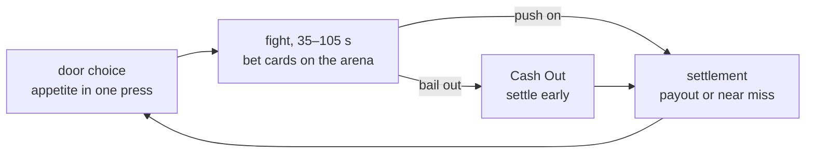

# Double or Die

[Русский](README.md) · English

A twin-stick roguelite where **you choose the difficulty yourself** — by
betting on your own performance.

Bet cards lie on the arena during the fight: "no damage", "under 45 seconds",
"no turning left". Picking one up is already a risk — it may sit in a corner
under fire. The bolder the bet, the fatter the pot, and the only one you lose
to is yourself.

The build lives at **[die.samoy.love](https://die.samoy.love)**; the nightly
of every commit to `main` is at
**[dev.die.samoy.love](https://dev.die.samoy.love)**. This is an internal
alpha for now — the public release starts with version 0.5.0.

## How it works

Bets live inside combat, not in menus between rooms. There is deliberately no
selection screen: it pulled the player out of the action thirty times per run
and ate up to half of the early rooms.



The table always has a second player: in co-op that's a friend who can bet
against you; solo it's **Ace**, the house dealer. He wagers his own chips,
haggles over the house cut, and remembers how your last run ended.

## Development

```bash
npm install
npm run dev      # game on localhost:5173
npm test         # unit tests and determinism
npm run sim      # headless runner, no graphics
npm run check    # lint, types, module boundaries
```

The simulation is **deterministic**: the same seed and the same inputs produce
the same state on any platform. Replays, daily runs with anti-cheat, golden
tests, Monte-Carlo balancing and online play all fall out of that one decision
for free. Verified in CI across three operating systems.

That is why the core contains no `Math.random`, no `Date.now` and no
`Math.sin` — only fixed-point arithmetic and lookup tables. A linter enforces
this, not good intentions.

The main verification tool is the headless runner: plain Node, JSON on stdout,
no graphics.

```bash
npm run sim -- --determinism-check --seeds 100
npm run sim -- --runs 500 --bot random --json
npm run safety   # is there always somewhere for the player to go
```

That last check is the most useful one in combat: it proves that on every tick
there is a position the player can still reach away from every announced
threat. A game that corners the player into an unwinnable enemy combination
fails a test instead of collecting a "it cheats" review.

## Documentation

Project strategy lives in [`docs/`](docs/) and takes precedence over code:
fifteen documents covering design, economy, difficulty and the release plan.
Written in Russian.

Repository conventions are in [CLAUDE.md](CLAUDE.md).

The repository stays private for the whole development period
([TECH.md §12А](docs/TECH.md)) — hence no CI badge and no license badge here:
they would not render for an anonymous reader anyway. Opening the code is a
separate decision to be made after release.

## Status

Version **0.3.0 "The Bet"**: bets live inside combat. A bet card is a
simulation entity with its own position, category, owner and a 720-tick
lifetime. The arena holds `N` personal cards plus 2 shared ones; a card is
taken by pressing a button rather than by running over it, and two players
grabbing the same card in the same tick is resolved deterministically. No
player can hold more than four active bets.

Six starting bets ship: no damage, no dash, under 45 seconds, stay out of the
red zone, collect every chip, demolitionist. Each tracks progress `q`, and
Cash Out pays `stake × (1 + q × (M−1)/2)` from it — bailing early returns just
the stake, while a bet held to the end pays double. A run opens with 30 chips:
the stake is `min(tier, wallet)`, so an empty wallet would make the whole
mechanic run on nothing. Stake size comes from three appetite tiers, and the
choice latches for the whole room: releasing the button does not undo it. A
bet that cannot be played on the player's input scheme is never dealt to them
— the exclusions live in the bet catalogue, while the scheme itself travels in
the input frame's bit mask. There are two control schemes: gamepad, and
keyboard with mouse — everything reachable on a pad is reachable on a keyboard.

Ace steps onto the arena once per room to toss a card: he comments on the
fight, telegraphs the toss, drops the card — and leaves three seconds later, a
top hat parked by the wall until the end of the fight stops being an event. His
second appearance is spent on mood: an event worth reacting to brings him out
itself, with the same telegraph. Applause at a failure, a thumbs down and a
standing ovation summon him; the yawn, the turn-away and the fidgeting are
background, visible only when he is already there. No more than two
appearances per room, and the gap between them counts from his exit. He appears
at a point computed from the centre of mass of every living player. The
settlement screen shows the near miss captured the moment the bet broke, not
reconstructed from the log afterwards.

Next up is 0.4.0 "The Run": a floor, a boss, the shop and the house cut.
