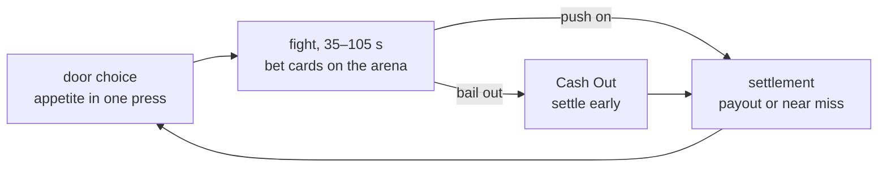

# Double or Die

[Русский](README.md) · English

A twin-stick roguelite where **you choose the difficulty yourself** — by
betting on your own performance.

Bet cards lie on the arena during the fight: "no damage", "under 45 seconds",
"no turning left". Picking one up is already a risk — it may sit in a corner
under fire. The bolder the bet, the fatter the pot, and the only one you lose
to is yourself.

The build lives at **[die.samoy.love](https://die.samoy.love)** — every commit
to `main` ships there. This is an internal alpha for now — the public release starts with version 0.5.0.

## How it works

Bets live inside combat, not in menus between rooms. There is deliberately no
selection screen: it pulled the player out of the action thirty times per run
and ate up to half of the early rooms.



The table always has a second player: in co-op that's a friend who can bet
against you; solo it's **Ace**, the house dealer. He wagers his own chips,
haggles over the house cut, and remembers how your last run ended.

## Development

```bash
npm install
npm run dev      # game on localhost:5173
npm test         # unit tests and determinism
npm run sim      # headless runner, no graphics
npm run check    # lint, types, module boundaries
```

The simulation is **deterministic**: the same seed and the same inputs produce
the same state on any platform. Replays, daily runs with anti-cheat, golden
tests, Monte-Carlo balancing and online play all fall out of that one decision
for free. Verified in CI across three operating systems.

That is why the core contains no `Math.random`, no `Date.now` and no
`Math.sin` — only fixed-point arithmetic and lookup tables. A linter enforces
this, not good intentions.

The main verification tool is the headless runner: plain Node, JSON on stdout,
no graphics.

```bash
npm run sim -- --determinism-check --seeds 100
npm run sim -- --runs 500 --bot random --json
npm run safety   # is there always somewhere for the player to go
```

That last check is the most useful one in combat: it proves that on every tick
there is a position the player can still reach away from every announced
threat. A game that corners the player into an unwinnable enemy combination
fails a test instead of collecting a "it cheats" review.

## Documentation

Project strategy lives in [`docs/`](docs/) and takes precedence over code:
fifteen documents covering design, economy, difficulty and the release plan.
Written in Russian.

Repository conventions are in [CLAUDE.md](CLAUDE.md).

The repository stays private for the whole development period
([TECH.md §12А](docs/TECH.md)) — hence no CI badge and no license badge here:
they would not render for an anonymous reader anyway. Opening the code is a
separate decision to be made after release.

## Status

Version **0.3.0 "The Bet"**: bets live inside combat, not in menus between
rooms. A bet card is picked up right on the arena, Cash Out settles it early,
and a bet held to the end pays double. Six starting bets ship, up to four
active at once. Ace is the solo opponent at the table: he comments on the
fight and occasionally tosses in a card.

Mechanics are detailed in [`docs/ECONOMY.md`](docs/ECONOMY.md) and
[`docs/GDD.md`](docs/GDD.md) (written in Russian).

Next up is 0.4.0 "The Run": a floor, a boss, the shop and the house cut.
