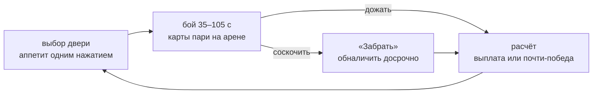

# Double or Die

Русский · [English](README.en.md)

[](https://github.com/tr0llex/double-or-die/actions/workflows/ci.yml)
[](LICENSE)

Твин-стик роглайт, где **сложность выбираешь ты сам** — пари на самого себя.

Во время боя на арене лежат карты-пари: «пройду без урона», «за 45 секунд»,
«не поворачивая налево». Подобрать карту — уже риск: она может валяться в
простреливаемом углу. Чем наглее пари, тем жирнее куш, а проигрываешь ты
только самому себе.

Играть — на **[die.samoy.love](https://die.samoy.love)** (скоро).

## Как это работает

Ставки живут внутри боя, а не в меню между ними. Отдельного экрана выбора нет
сознательно: он выдёргивал игрока из действия три десятка раз за забег и
съедал до половины ранних комнат.



Второй игрок за столом есть всегда: в коопе это друг, который может поставить
против тебя, в соло — **Туз**, ведущий заведения. Он ставит из своего кармана,
торгуется о доле заведения и помнит, чем закончился прошлый забег.

## Разработка

```bash
npm install
npm run dev      # игра на localhost:5173
npm test         # юнит-тесты и детерминизм
npm run sim      # headless-раннер без графики
npm run check    # линт, типы, границы модулей
```

Симуляция **детерминирована**: одинаковый сид и одинаковые инпуты дают
одинаковое состояние на любой платформе. Из этого бесплатно получаются
реплеи, дейли с античитом, golden-тесты, Monte-Carlo балансировка и онлайн.
Проверяется в CI на трёх операционных системах сразу.

Поэтому в ядре нет ни `Math.random`, ни `Date.now`, ни `Math.sin` — только
арифметика с фиксированной точкой и таблицы. Это ловит линтер, а не совесть.

Основной инструмент проверки — headless-раннер: чистый Node, JSON в stdout,
без графики.

```bash
npm run sim -- --determinism-check --seeds 100
npm run sim -- --runs 500 --bot random --json
```

## Документация

Стратегия проекта живёт в [`docs/`](docs/) и первична по отношению к коду:
пятнадцать документов от дизайна и экономики до плана релизов. Начинать —
с [глоссария](docs/GLOSSARY.md) и [плана](docs/ROADMAP.md).

Соглашения репозитория — в [CLAUDE.md](CLAUDE.md).

## Статус

Версия **0.1.0 «Скелет»**: детерминированное ядро, инструменты проверки,
доставка сборки. Геймплея пока нет — бой приезжает в 0.2.0, ставки в 0.3.0.
