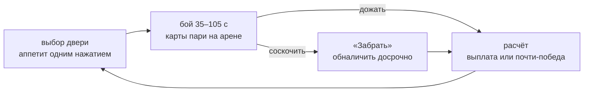

# Double or Die

Русский · [English](README.en.md)

Твин-стик роглайт, где **сложность выбираешь ты сам** — пари на самого себя.

Во время боя на арене лежат карты-пари: «пройду без урона», «за 45 секунд»,
«не поворачивая налево». Подобрать карту — уже риск: она может валяться в
простреливаемом углу. Чем наглее пари, тем жирнее куш, а проигрываешь ты
только самому себе.

Сборка живёт на **[die.samoy.love](https://die.samoy.love)**, nightly каждого
коммита в `main` — на **[dev.die.samoy.love](https://dev.die.samoy.love)**.
Сейчас это внутренняя альфа: публичный выпуск начинается с версии 0.5.0.

## Как это работает

Ставки живут внутри боя, а не в меню между ними. Отдельного экрана выбора нет
сознательно: он выдёргивал игрока из действия три десятка раз за забег и
съедал до половины ранних комнат.



Второй игрок за столом есть всегда: в коопе это друг, который может поставить
против тебя, в соло — **Крупье**, ведущий заведения. Он ставит из своего кармана,
торгуется о доле заведения и помнит, чем закончился прошлый забег.

## Разработка

```bash
npm install
npm run dev      # игра на localhost:5173
npm test         # юнит-тесты и детерминизм
npm run sim      # headless-раннер без графики
npm run check    # линт, типы, границы модулей
```

Симуляция **детерминирована**: одинаковый сид и одинаковые инпуты дают
одинаковое состояние на любой платформе. Из этого бесплатно получаются
реплеи, дейли с античитом, golden-тесты, Monte-Carlo балансировка и онлайн.
Проверяется в CI на трёх операционных системах сразу.

Поэтому в ядре нет ни `Math.random`, ни `Date.now`, ни `Math.sin` — только
арифметика с фиксированной точкой и таблицы. Это ловит линтер, а не совесть.

Основной инструмент проверки — headless-раннер: чистый Node, JSON в stdout,
без графики.

```bash
npm run sim -- --determinism-check --seeds 100
npm run sim -- --runs 500 --bot random --json
npm run safety   # всегда ли игроку есть куда уйти от объявленных атак
```

Последняя проверка — самая полезная в бою: она доказывает, что в каждый тик
существует позиция, куда игрок успевает уйти от всех объявленных угроз. Игра,
загнавшая игрока в безвыходную комбинацию врагов, роняет тест, а не получает
отзыв «жульничает».

## Документация

Стратегия проекта живёт в [`docs/`](docs/) и первична по отношению к коду:
пятнадцать документов от дизайна и экономики до плана релизов. Начинать —
с [глоссария](docs/GLOSSARY.md) и [плана](docs/ROADMAP.md).

Соглашения репозитория — в [CLAUDE.md](CLAUDE.md).

Репозиторий приватный на весь период разработки
([TECH.md §12А](docs/TECH.md)) — поэтому здесь нет ни бейджа CI, ни бейджа
лицензии: анонимному читателю они всё равно не отрисуются. Открытие кода —
отдельное решение после релиза.

## Статус

Версия **0.3.0 «Ставка»**: ставки живут внутри боя, а не в меню между ними.
Карта пари подбирается прямо на арене, «Забрать» обналичивает её досрочно, а
дожатая до конца карта платит вдвое. Шесть стартовых пари, до четырёх активных
одновременно. Крупье — соло-соперник по столу: комментирует бой и время от
времени подбрасывает карту.

Подробности механики — в [`docs/ECONOMY.md`](docs/ECONOMY.md) и
[`docs/GDD.md`](docs/GDD.md).

Дальше — 0.4.0 «Забег»: этаж, босс, магазин и доля заведения.
